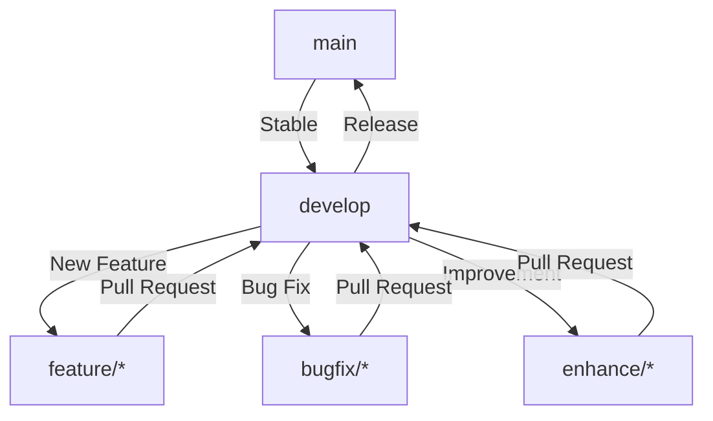

# Moedah POS

A high-performance, modern Point of Sale (POS) system designed for efficiency and scalability. Built with a robust **Go** backend and a dynamic **Next.js** frontend.

## 🚀 Git Flow & Branching Strategy

We follow a structured branching model to ensure code quality and seamless integration.

### Branch Overview

| Branch Type | Name | Purpose |
| :--- | :--- | :--- |
| **Main** | `main` | Production-ready code. Each release is tagged here. |
| **Development** | `develop` | The primary integration branch for new code. |
| **Features** | `feature/*` | New functionality being developed. |
| **Bug Fixes** | `bugfix/*` | Critical and non-critical bug fixes. |
| **Enhancements** | `enhance/*` | Improvements, refactoring, and optimizations. |

### Development Workflow

1.  **Start from `develop`**: All feature, bugfix, and enhance branches MUST branch off from `develop`.
2.  **Pull Requests**: Code is merged back into `develop` via Pull Requests.
3.  **Deployment**: Once `develop` is stable, it is merged into `main` for release.

---

## 🛠 Tech Stack

- **Backend**: Go (Golang)
- **Frontend**: Next.js (TypeScript)
- **Database**: PostgreSQL (Managed via migrations)
- **API**: RESTful API
- **Tooling**: Docker, Makefile, golangci-lint

## 📏 Project Standards

For detailed coding standards, verification workflows, and guardrails, please refer to [GEMINI.md](./GEMINI.md).

---

© 2026 Moedah POS. All rights reserved.
